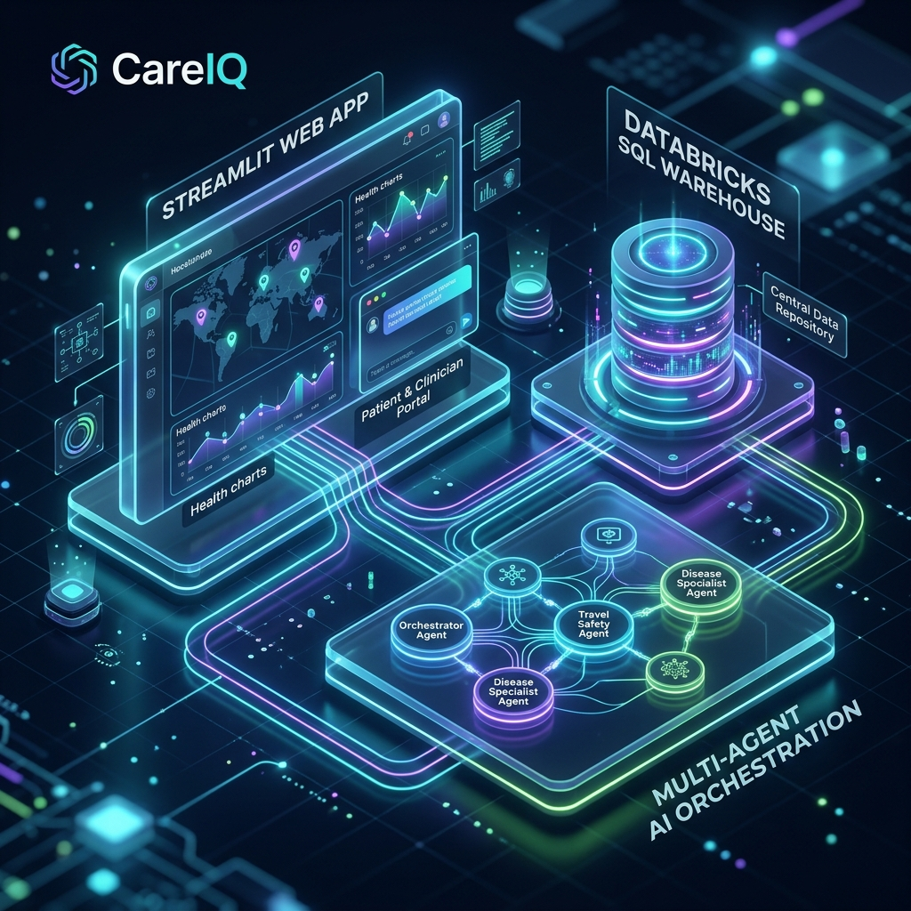
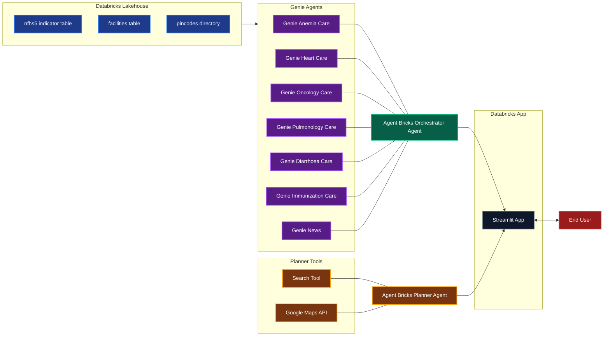

# CareIQ System Architecture

This document details the system architecture of **CareIQ — AI-Powered Care Gap Intelligence** using a simplified left-to-right (LR) conceptual structure.

## System Architecture Concept Illustration

## Simplified Left-to-Right Architecture Flow (Mermaid)

